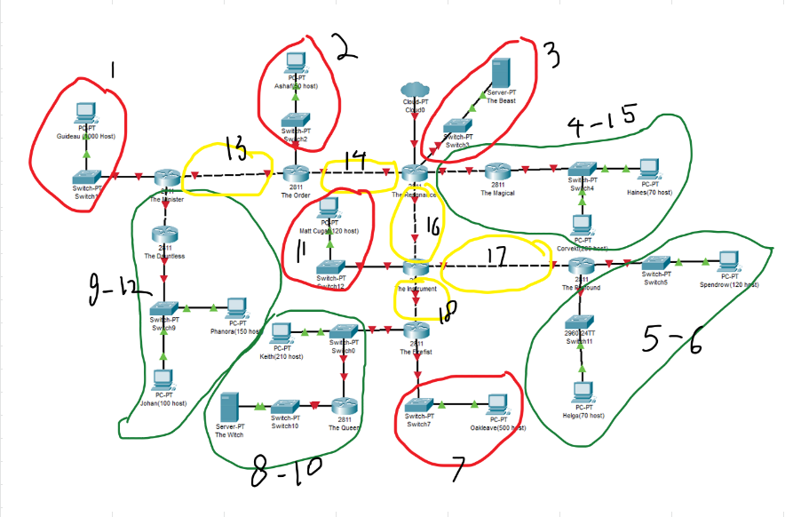
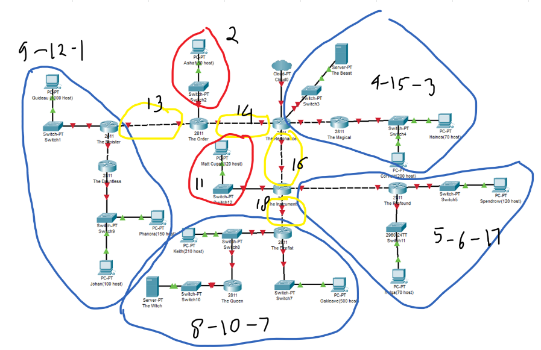
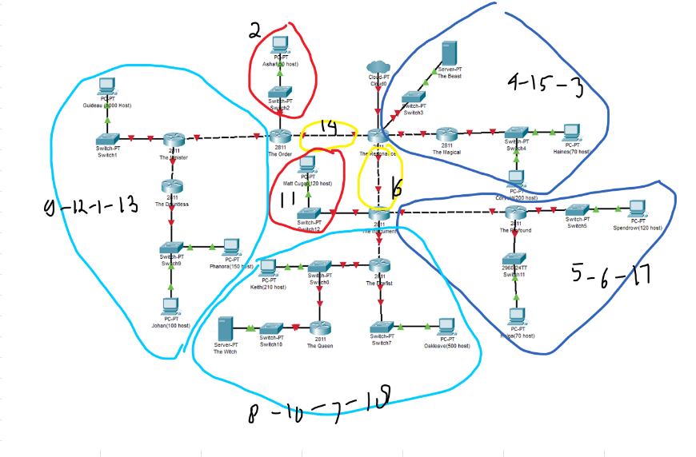
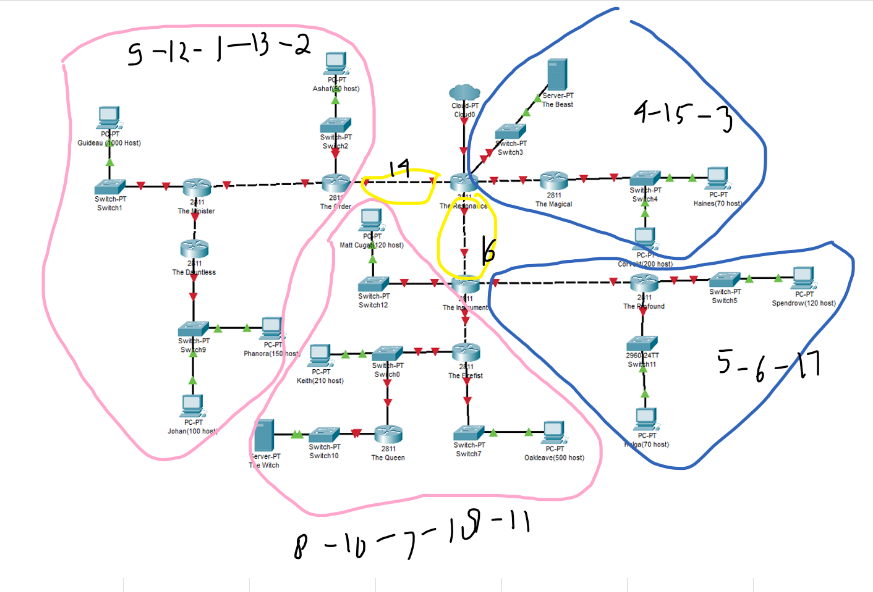
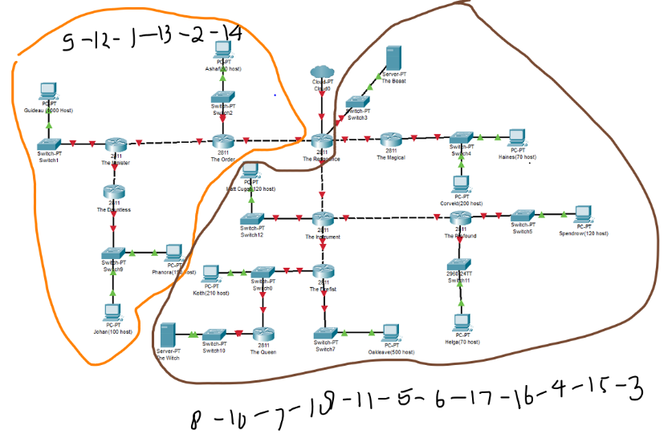
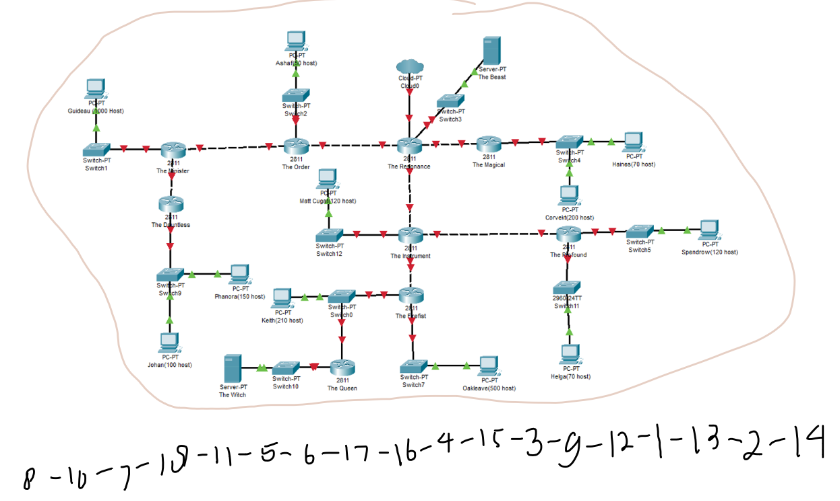
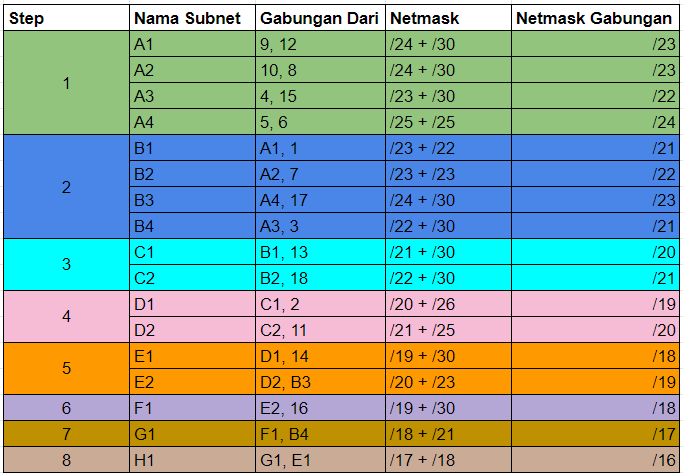
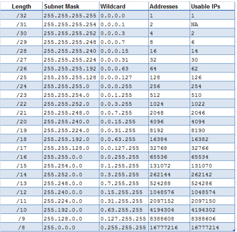
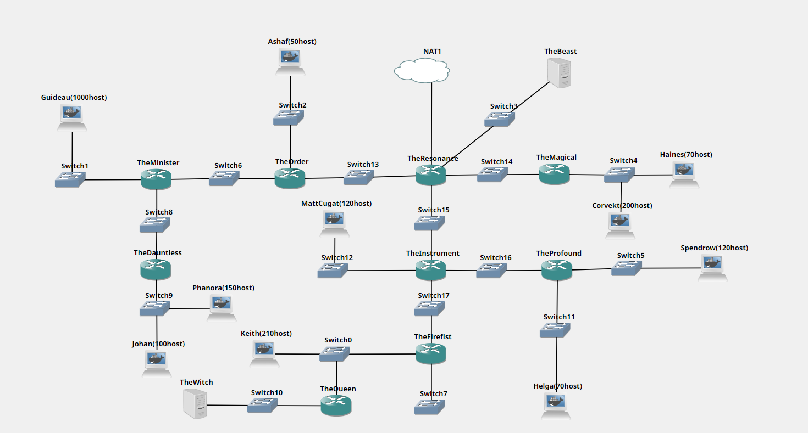

# Jarkom-Modul-4-ITB06-2022

Repository ini dibuat sebagai laporan resmi untuk pengerjaan [Soal Shift Modul 4](https://docs.google.com/document/d/1a_ITp6WYIqoJFXA2oL1jkox9AzqYGxicjr2LGPBsqBE/edit) dari praktikum Mata Kuliah Komunikasi Data dan Jaringan Komputer.

**Anggota Kelompok ITB06**

- Sarah Hanifah Pontoh 5027201006
- Sharira Saniane 5027201016
- Naufal Dhiya Ulhaq 5027201029

## Table of Contents

## Soal

Pada praktikum ini, kami diminta untuk membuat topologi sebagai berikut:  
  
Dari topologi tersebut, kami selanjutnya diminta untuk melakukan subnetting serta routing dengan menggunakan metode perhitungan Classless (VLSM & CIDR). Untuk melakukan perintah tersebut, kami diminta untuk memerhatikan beberapa hal:

- Soal shift dikerjakan pada Cisco Packet Tracer dan GNS3 menggunakan metode perhitungan CLASSLESS yang berbeda.
- Pembagian IP menggunakan Prefix IP yang telah ditentukan pada modul pengenalan (pada kelompok kami 192.217).
- Pembagian IP dan routing harus SE-EFISIEN MUNGKIN.

## Pengerjaan Soal

### VLSM

Sebelum melakukan metode perhitungan VLSM, kami membagi subnet-subnet pada topologi yang ada sebagai berikut:

Setelah melakukan pembagian subnet tersebut, kami mencoba untuk membuat tabel kebutuhan host pada tiap subnet sebagai berikut:

| Label Subnet | Jumlah Host yang Dibutuhkan | Netmask |
| ------------ | --------------------------- | ------- |
| 1            | 1001                        | /22     |
| 4            | 271                         | /23     |
| 7            | 501                         | /23     |
| 9            | 251                         | /24     |
| 10           | 212                         | /24     |
| 5            | 121                         | /25     |
| 6            | 71                          | /25     |
| 11           | 121                         | /25     |
| 2            | 51                          | /26     |
| 3            | 2                           | /30     |
| 8            | 2                           | /30     |
| 12           | 2                           | /30     |
| 13           | 2                           | /30     |
| 14           | 2                           | /30     |
| 15           | 2                           | /30     |
| 16           | 2                           | /30     |
| 17           | 2                           | /30     |
| 18           | 2                           | /30     |
| TOTAL        | 2618                        | /20     |

### CIDR

Berikut adalah langkah langkah yang dilakukan dalam mengkombinasikan subnet untuk CIDR:

1.

2.

3.

4.

5.

6.

7.

8.

Berikut adalah tabel kesimpulan untuk kombinasi-kombinasi CIDR yang telah dilakukan.

Oleh karena itu, pohon CIDR dimulai dengan netmask /16. Sehingga pohon yang digunakan untuk subnet CIDR adalah:

Setelah pohon tersebut sudah diselesaikan, dibuat tabel subnetting CIDR, yaitu:

### Cisco

Pertama-tama kami membuat topologi terlebih dahulu seperti berikut :

